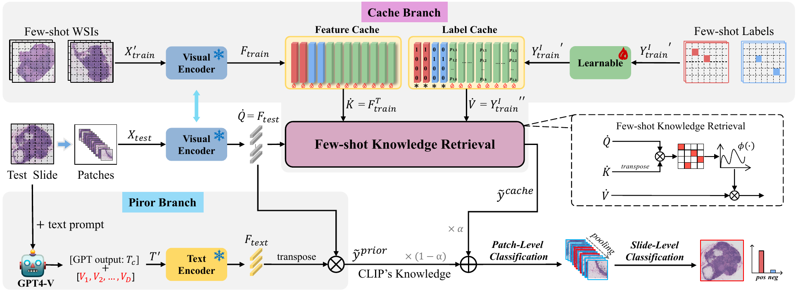

🚀 FAST: A Dual-tier Few-Shot Learning Paradigm for Whole Slide Image Classification 
===========
###  *NeurIPS 2024* | [Conference Link](https://proceedings.neurips.cc/paper_files/paper/2024/file/bdcdf38389d7fcefc73c4c3720217155-Paper-Conference.pdf) 


**Abstract:** The expensive fine-grained annotation and data scarcity have become the primary obstacles for the widespread adoption of deep learning-based Whole Slide Images (WSI) classification algorithms in clinical practice. Unlike few-shot learning methods in natural images that can leverage the labels of each image, existing few-shot WSI classification methods only utilize a small number of fine-grained labels or weakly supervised slide labels for training in order to avoid expensive fine-grained annotation. They lack sufficient mining of available WSIs, severely limiting WSI classification performance. To address the above issues, we propose a novel and efficient dual-tier few-shot learning paradigm for WSI classification, named FAST. FAST consists of a dual-level annotation strategy and a dual-branch classification framework. Firstly, to avoid expensive fine-grained annotation, we collect a very small number of WSIs at the slide level, and annotate an extremely small number of patches. Then, to fully mining the available WSIs, we use all the patches and available patch labels to build a cache branch, which utilizes the labeled patches to learn the labels of unlabeled patches and through knowledge retrieval for patch classification. In addition to the cache branch, we also construct a prior branch that includes learnable prompt vectors, using the text encoder of visual-language models for patch classification. Finally, we integrate the results from both branches to achieve WSI classification. Extensive experiments on binary and multi-class datasets demonstrate that our proposed method significantly surpasses existing few-shot classification methods and approaches the accuracy of fully supervised methods with only 0.22$\%$ annotation costs.

## Installation
First clone the repo and cd into the directory:
```shell
git clone https://github.com/fukexue/FAST
cd FAST
```
Then create a conda env and install the dependencies:
```shell
conda create -n fast python=3.8 -y
conda activate fast
pip install --upgrade pip
pip install -r requirements.txt
```

## Dataset
We have processed the WSI data at a 5x magnification level and extracted features. The processed dataset can be downloaded from the link below.

We are uploading the data.
[Dataset Link](https://proceedings.neurips.cc/paper_files/paper/2024/file/bdcdf38389d7fcefc73c4c3720217155-Paper-Conference.pdf) 


## Pretrain Weights
You need to download the model weights for [CLIP](https://github.com/openai/CLIP), [CONCH](https://github.com/mahmoodlab/CONCH), and [PLIP](https://github.com/PathologyFoundation/plip) separately and place them in their respective folders.

## Train and Eval
### 1. For training and evaluating on the CAMELYON16 Dataset
```shell
cd scripts
bash Exp_CAMELYON_CLIP.sh
bash Exp_CAMELYON_CONCH.sh
bash Exp_CAMELYON_PLIP.sh
```
### 2. For training and evaluating on the TCGA_RENAL Dataset
```shell
cd scripts
bash Exp_TCGA_RENAL_CLIP.sh
```


## Reference
If you find our work useful in your research or if you use parts of this code please consider citing our [paper](https://proceedings.neurips.cc/paper_files/paper/2024/file/bdcdf38389d7fcefc73c4c3720217155-Paper-Conference.pdf):
```
@article{lu2024avisionlanguage,
  title={Fast: A Dual-tier Few-shot Learning Paradigm for Whole Slide Image Classification},
  author={Kexue Fu, Xiaoyuan Luo, Linhao Qu, Shuo Wang, Ying Xiong, Ilias Maglogiannis, Longxiang Gao, Manning Wang},
  pages={105090-105113},
  volume={37},
  year={2024},
  journal={Advances in Neural Information Processing Systems}
}
```