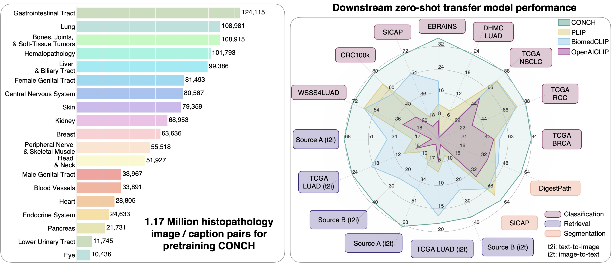

# Model Card for CONCH
 \[[Journal Link](https://www.nature.com/articles/s41591-024-02856-4)\] | \[[Open Access Read Link](https://rdcu.be/dBMf6)\] | [\[Github Repo](https://github.com/mahmoodlab/CONCH)\] | \[[Cite](#how-to-cite)\] 

## What is CONCH?
CONCH (CONtrastive learning from Captions for Histopathology) is a vision language foundation model for histopathology, pretrained on currently the largest histopathology-specific vision-language dataset of 1.17M image caption pairs. Compare to other vision language foundation models, it demonstrates state-of-the-art performance across 14 tasks in computational pathology ranging from image classification, text-to-image, and image-to-text retrieval, captioning, and tissue segmentation.
- _**Why use CONCH?**_: Compared to popular self-supervised encoders for computational pathology that were pretrained only on H&E images, CONCH may produce more performant representations for non-H&E stained images such as IHCs and special stains, and can be used for a wide range of downstream tasks involving either or both histopathology images and text. CONCH also did not use large public histology slide collections such as TCGA, PAIP, GTEX, etc. for pretraining, which are routinely used in benchmark development in computational pathology. Therefore, we make CONCH available for the research community in building and evaluating pathology AI models with minimal risk of data contamination on public benchmarks or private histopathology slide collections.



## Requesting Access

As mentioned in the gated prompt, you must agree to the outlined terms of use, _**with the primary email for your HuggingFace account matching your institutional email**_. If your primary email is a personal email (@gmail/@hotmail/@qq) **your request will be denied**. To fix this, you can: (1) add your official institutional email to your HF account, and confirm your email address to verify, and (2) set your institutional email as your primary email in your HF account. Other reasons for your request access being denied include other mistakes in the form submitted, for example: full name includes abbreviations, affiliation is not spelled out, the described research use is not sufficient, or email domain address not recognized.

## License and Terms of Use

This model and associated code are released under the CC-BY-NC-ND 4.0 license and may only be used for non-commercial, academic research purposes with proper attribution. Any commercial use, sale, or other monetization of the CONCH model and its derivatives, which include models trained on outputs from the CONCH model or datasets created from the CONCH model, is prohibited and requires prior approval. Downloading the model requires prior registration on Hugging Face and agreeing to the terms of use. By downloading this model, you agree not to distribute, publish or reproduce a copy of the model. If another user within your organization wishes to use the CONCH model, they must register as an individual user and agree to comply with the terms of use. Users may not attempt to re-identify the deidentified data used to develop the underlying model. If you are a commercial entity, please contact the corresponding author.


## Model Details

### Model Description

- **Developed by:** Mahmood Lab AI for Pathology Lab @ Harvard/BWH
- **Model type:** Pretrained vision-language encoders (vision encoder: ViT-B/16, 90M params; text encoder: L12-E768-H12, 110M params)
- **Pretraining dataset:** 1.17 million histopathology image-caption pairs
- **Repository:** https://github.com/mahmoodlab/CONCH
- **Paper:** https://www.nature.com/articles/s41591-024-02856-4
- **License:** CC-BY-NC-ND-4.0

Note: while the original CONCH model arechitecture also includes a multimodal decoder trained with the captioning loss of CoCa, as additional precaution to ensure that no proprietary data or Protected Health Information (PHI) is leaked untentionally, we have removed the weights for the decoder from the publicly released CONCH weights. 
The weights for the text encoder and the vision encoder are intact and therefore the results on all key tasks presented in the paper such as image classification and image-text retrieval are not affected.
The ability of CONCH to serve as a general purpose encoder for both histopathology images and pathology-related text also remains unaffected. 

### Usage
Install the conch repository using pip:
```shell
pip install git+https://github.com/Mahmoodlab/CONCH.git
```

After succesfully requesting access to the weights:
```python
from conch.open_clip_custom import create_model_from_pretrained
model, preprocess = create_model_from_pretrained('conch_ViT-B-16', "hf_hub:MahmoodLab/conch", hf_auth_token="<your_user_access_token>")
```

Note you may need to supply your huggingface user access token via `hf_auth_token=<your_token>` to `create_model_from_pretrained` for authentification. See the [HF documentation](https://huggingface.co/docs/hub/security-tokens) for more details.

Alternatively, you can download the checkpoint mannually, and load the model as follows:
```python
model, preprocess = create_model_from_pretrained('conch_ViT-B-16', "path/to/conch/pytorch_model.bin")
```

You can then use the model to encode images as follows:
```python
import torch
from PIL import Image
image = Image.open("path/to/image.jpg")
image = preprocess(image).unsqueeze(0)
with torch.inference_mode():
    image_embs = model.encode_image(image, proj_contrast=False, normalize=False)
```

This will give you the image embeddings before the projection head and normalization, suitable for linear probe or working with WSIs under the multiple-instance learning framework. 

For image-text retrieval tasks, you should use the normalized and projected embeddings as follows:
```python
with torch.inference_mode():
    image_embs = model.encode_image(image, proj_contrast=True, normalize=True)
    text_embedings = model.encode_text(tokenized_prompts)
    sim_scores = (image_embedings @ text_embedings.T).squeeze(0)
```

For concrete examples on using the model for various tasks, please visit the [github](https://github.com/mahmoodlab/CONCH) repository.

### Use Cases

The model is primarily intended for researchers and can be used to perform tasks in computational pathology such as:
- Zero-shot ROI classification
- Zero-shot ROI image to text and text to image retrieval
- Zero-shot WSI classification using MI-Zero
- ROI classification using linear probing / knn probing / end-to-end fine-tuning
- WSI classification using with multiple instance learning (MIL)

## Training Details

- **Training data:** 1.17 million human histopathology image-caption pairs from publicly available Pubmed Central Open Access (PMC-OA) and internally curated sources. Images include H&E, IHC, and special stains.
- **Training regime:** fp16 automatic mixed-precision
- **Training objective:** CoCa (image-text contrastive loss + captioning loss)
- **Hardware:** 8 x Nvidia A100
- **Hours used:**  ~21.5 hours
- **Software:** PyTorch 2.0, CUDA 11.7

Note: The vision encoder and the text encoder / decoder are first pretrained separately and then fine-tuned together using the CoCa loss. See the paper for more details.

## Contact

For any additional questions or comments, contact Faisal Mahmood (`faisalmahmood@bwh.harvard.edu`), 
Ming Y. Lu (`mlu16@bwh.harvard.edu`), 
or Bowen Chen (`bchen18@bwh.harvard.edu`).

## Acknowledgements

The project was built on top of amazing repositories such as [openclip](https://github.com/mlfoundations/open_clip) (used for model training),  [timm](https://github.com/huggingface/pytorch-image-models/) (ViT model implementation) and [huggingface transformers](https://github.com/huggingface/transformers) (tokenization). We thank the authors and developers for their contribution. 

## How to Cite

```
@article{lu2024avisionlanguage,
  title={A visual-language foundation model for computational pathology},
  author={Lu, Ming Y and Chen, Bowen and Williamson, Drew FK and Chen, Richard J and Liang, Ivy and Ding, Tong and Jaume, Guillaume and Odintsov, Igor and Le, Long Phi and Gerber, Georg and others},
  journal={Nature Medicine},
  pages={863–874},
  volume={30},
  year={2024},
  publisher={Nature Publishing Group}
}
```